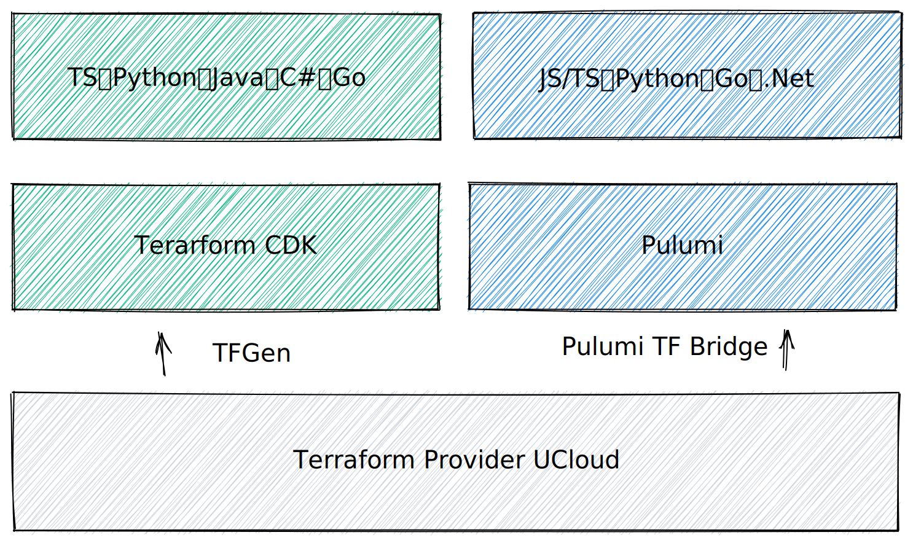

# 什么是 CDK

## 起源

CDK 是一个开源的软件开发框架，使用户可以基于基础设施代码（IaC，Infrastructure as Code）的理念来构建云上基础设施。

CDK 于 2019 年 7 月由 AWS 提出，其目的是使用户采用通用编程语言（GPL，Gerneral Purpose Language）来管理 CloudFormation 的资源模版。AWS 初代 CDK 支持 Typescript、C#、Java、Python 四种通用编程语言。

随着 IaC 相关基础设施的发展，一些知名的开源生态也提供了新的解决方案。

- 对于 Terraform 的用户，Hashicorp 提供了 cdktf 工具，用于在 Terraform 生态的基础上，提供 CDK 结构。
- 对于 Kubernetes 的用户，CNCF 提供了 cdk8s 工具，用于在 Kubernetes 生态的基础上，提供 CDK 结构。
- 现代的 IaC 工具 Pulumi 也提供了 CDK 结构来管理云上资源，并提供了更高级的抽象，使用户可以将应用软件和基础设施一同编写。

## CDK 解决了什么问题

与 领域特定语言（DSL，Domain Specified Language）/Yaml 相比，CDK：

1. 采用通用编程语言，不会带来额外的语言学习成本
2. 具有图灵完备性，可以采用现代编程范式对基础设施代码进行高阶抽象
3. 具备良好的可测试性，可以通过 mock 等手段进行单元测试

## CDK 的实现方式

UCloud 的 CDK 系列产品，采取拥抱 IaC 社区的演进路线，相关代码直接合并至上游，如下图所示。

UCloud 的两款 CDK 工具（Terraform CDK、Pulumi）都基于 Terraform Provider 生成，当 Terraform Provider 添加了新的资源，CDK 产品将同步更新，保持关联产品的一致性。

